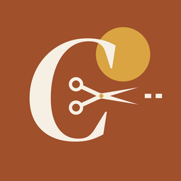
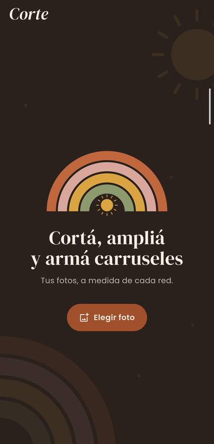
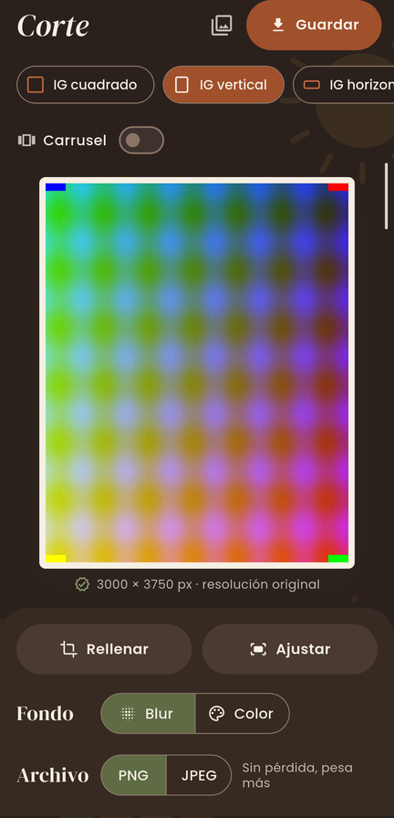
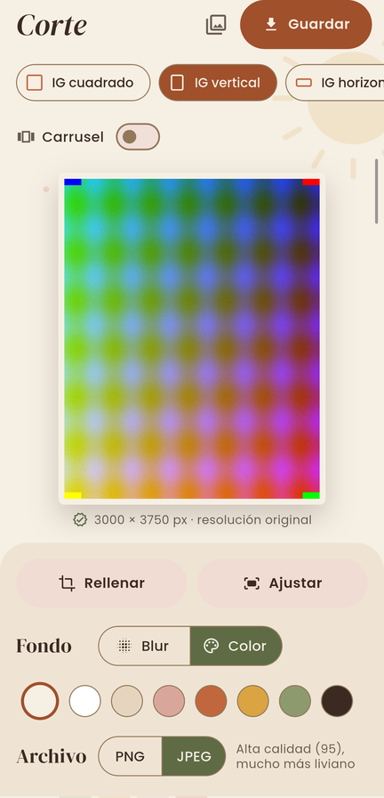

<p align="center"></p>

<h1 align="center">Corte</h1>

<p align="center">Recortá, ampliá y armá carruseles para redes sociales, sin perder resolución y sin conexión.</p>

<p align="center">
  
  
  
</p>

## Qué hace

- **Recorta** una foto a los tamaños de cada red: Instagram (cuadrado, vertical, horizontal), Stories/Reels/TikTok, Facebook, X, LinkedIn y miniatura de YouTube.
- **Arma carruseles** partiendo una foto grande en 2 a 10 slides contiguos.
- **Amplía sin deformar**: si la foto no entra en el formato, la ajusta entera y rellena con fondo desenfocado o un color.
- **Editor WYSIWYG**: pellizcar y arrastrar; lo que se ve es exactamente lo que se guarda.
- **Guarda en la galería** como PNG (sin pérdida) o JPEG de alta calidad (calidad 95, mucho más liviano).

## Garantías

- **Resolución original.** El recorte se exporta a resolución nativa (1 píxel de la foto = 1 píxel de salida) y nunca se reduce. Solo se amplía si el recorte queda por debajo del mínimo de la red. Debajo del marco se muestra en vivo el tamaño exacto que se va a guardar.
- **Píxeles idénticos.** En PNG, cada píxel exportado es idéntico al original; lo verifican los tests, también en la GPU de un dispositivo real.
- **100 % offline.** La versión release no pide permiso de internet. Las fuentes van incluidas y el guardado es local.
- **Accesible.** Todas las combinaciones de color cumplen WCAG AA, en modo claro y oscuro.

## Requisitos

- Flutter 3.45 o superior
- Android 7.0 (API 24) o superior; iOS con Xcode (compila pero todavía no se probó en un iPhone)

## Uso

```bash
flutter pub get
flutter run                  # debug en el dispositivo conectado
flutter build apk --release  # APK en build/app/outputs/flutter-apk/
```

## Tests

```bash
flutter test                                 # lógica de encuadre y exactitud de píxeles
flutter test integration_test -d <device-id> # en el dispositivo: 12 MP, 50 MP y JPEG en la GPU real
```

## Estructura

| Ruta | Contenido |
|---|---|
| `lib/main.dart` | Editor (pantalla única) |
| `lib/render.dart` | Formatos, decodificación a resolución completa y exportación PNG/JPEG |
| `lib/boho.dart` | Paleta, tema y adornos dibujados |
| `android/.../MainActivity.kt`, `ios/Runner/AppDelegate.swift` | Codificador JPEG nativo (canal `corte/jpeg`) |
| `tool/make_icon.py` | Genera el ícono para Android e iOS (`python tool/make_icon.py`, requiere Pillow) |

## Créditos

Tipografías [DM Serif Display](https://fonts.google.com/specimen/DM+Serif+Display) y [Poppins](https://fonts.google.com/specimen/Poppins), bajo la SIL Open Font License (ver `assets/fonts/`).
